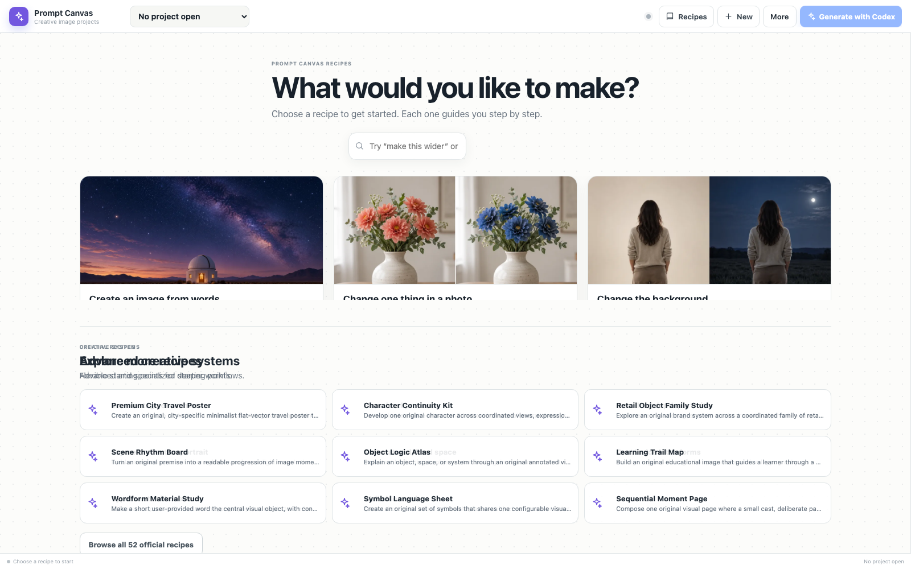

# Prompt Canvas

Prompt Canvas is a standalone, local-first image-prompt workspace built on the tldraw SDK for use inside the ChatGPT desktop app. People compose prompts directly on a spatial canvas using freeform text, optional presets, references, workflows, and output regions. Codex reads that live state through WebMCP, performs native image generation or editing, and returns validated image assets to the canvas.

Despite the repository name, this application is **not a Fogwood feature or compatibility layer**. It has its own schemas, persistence keys, runtime, and WebMCP namespace.

Prompt Canvas opens with an outcome-first recipe gallery. Starting a recipe creates a light, quiet spatial workflow:
modular input and choice blocks feed a dominant result card through visible canvas connections, while the full prompt
and advanced controls remain available without leading the first-run experience.

## Human + agent, one visual project

Prompt Canvas turns image prompting into a shared spatial workspace. A person chooses a recipe and directly adjusts
the brief, references, preservation rules, and creative controls. Through WebMCP, Codex can search the official recipe
library, create or update the same live project, generate from its current state, and return the resulting image to the
correct canvas output with lineage.

**Live app:** https://prompt-canvas.madebyhenry.chatgpt.site

**Competition build:** [v0.4.0 exact tagged source](https://github.com/HenryBranchAdams/Prompt-Canvas/releases/tag/v0.4.0)

Try it in a Website Tools-enabled ChatGPT desktop session:

> Search Prompt Canvas's official recipes for the simplest way to create an image from words. Open it for “a quiet lunar greenhouse at dawn.”



## Product boundary

```text
Prompt Canvas                              Codex in ChatGPT desktop
──────────────────────────────────────     ─────────────────────────────
Prompt and preset editing                  Conversation and reasoning
Recipe gallery                             Native image generation
Reference and output organization    <──>  Image editing and variations
Local tldraw persistence                   Upscaling
Stable WebMCP tool baseline                 Tool orchestration
Validated asset import                     Returns generated image material
```

The page never asks for an OpenAI API key and never calls an image model directly. Its generation tool only resolves bounded context. Image creation remains a Codex host capability.

## Product baseline

- A light, warm-white tldraw surface with a quiet dot grid as the default visual direction.
- Directly interactive prompt and preset-control panels; the header is the canvas drag handle.
- A first-run recipe gallery with six everyday `Start fast` recipes, real first-party previews, ordinary-language search, and one obvious `Start` action.
- Four additional outcome-first official recipes for exact-text posters, collectible cards, four-direction exploration, and composition-preserving restyles.
- Forty-two independently authored task-focused systems and nine preserved advanced creative systems, for 61 original first-party recipes in the bundled fallback. The gallery is a baseline, not a product limit.
- A read-only, owner-controlled D1 catalog for 52 official recipes, with bounded FTS5 retrieval and structured facets. User-saved recipes remain local to the browser.
- Modular input, essential-choice, prompt, reference, workflow, result, and variation blocks connected visibly to the intended output.
- Blank workspace creation, duplication, immutable starter instances, and save-as-template.
- Thin `prompt-canvas.prompt-workspace-template@2` compatibility core with non-blocking lint and creative guidance.
- One prompt workspace per tldraw page, with local persistence across reloads. The current `maxPages` setting is an implementation guard, not a product law.
- Revision-aware, atomic, one-step-undoable mutation of an existing canvas workspace. Workspace and template-library lifecycle writes are validated, durably reported, and conflict-aware where applicable. The current page-deletion operation is one tldraw undo step; creation and template-library writes do not claim a canvas-history guarantee they do not implement.
- Bounded PNG, JPEG, and WebP validation with byte, dimension, pixel, MIME, and digest checks.
- Generated-asset provenance and variation/edit lineage.

## WebMCP tools

These established tools form the v0.1 compatibility baseline. Their names and machine-readable contracts remain stable; compatible additions may extend the catalog:

```text
prompt_canvas_inspect
prompt_canvas_list_templates
prompt_canvas_get_template
prompt_canvas_validate_template
prompt_canvas_get_generation_context
prompt_canvas_create_workspace
prompt_canvas_update_workspace
prompt_canvas_save_template
prompt_canvas_add_generated_asset
prompt_canvas_manage_outputs
```

`prompt_canvas_delete_workspace` is the catalog's current additive lifecycle tool. It requires explicit confirmation and the expected revision, does not delete the final remaining workspace, and is not part of the original ten-tool baseline.

There is intentionally no page-owned `generate_image` tool. The flow is:

```text
canvas prompt + controls
  -> prompt_canvas_get_generation_context
  -> Codex native image generation / editing
  -> prompt_canvas_add_generated_asset
  -> validated tldraw output with lineage
```

## Local development

Requirements: Node.js 22.13 or newer, npm, and Python 3. The Python packages used by source generation and contract validation are declared in `requirements-dev.txt` rather than being an undocumented machine prerequisite.

```bash
python3 -m venv .venv
source .venv/bin/activate
python -m pip install -r requirements-dev.txt
npm install
npm run dev
```

A tldraw license key may be supplied when required by your license:

```bash
cp .env.example .env.local
```

Do not place OpenAI credentials in the page. None are required.

### Official recipe catalog

The public application works without D1 by falling back to the 52 bundled official recipe summaries and exact bundled
templates. To validate and seed the local D1 catalog:

```bash
npm run catalog:build
npm run catalog:seed:local
```

Official source files live under `starter-pack/templates/`; `npm run catalog:build` validates them, records immutable
version hashes, and emits the deterministic catalog plus D1 seed/migrations. Production publishing is repository-driven:
there are no public create, update, delete, submission, or moderation routes. See
[Official Prompt Library](docs/OFFICIAL_PROMPT_LIBRARY.md) for the complete publishing and recovery contract.

## Verification

```bash
npm run check
npx playwright install chromium
npm run test:e2e
```

`npm run check` regenerates the starter sources, validates all templates and WebMCP schemas, runs deterministic core tests, type-checks, lints, and builds the production bundle.

Release checks and host results are evidence for one exact commit and deployment, not a promise about later checkouts. See [Implementation Status](docs/IMPLEMENTATION_STATUS.md) for the boundary.

The Playwright suite installs a mock top-level WebMCP host and proves the page-side portion of the vertical slice:

1. the catalog's baseline tools register;
2. first run keeps the quick recipes prominent and initially collapses the official long tail to eight entries without auto-creating a project;
3. a recipe opens as a connected modular canvas whose controls work directly;
4. the Travel Poster advanced example retains its authored workflow geometry;
5. generation context resolves;
6. a bounded image payload returns through `prompt_canvas_add_generated_asset` and appears in the intended tldraw output;
7. generated outputs and references, including native-sized PNG fixtures, use durable local asset storage and survive reload;
8. an agent-authored flexible template validates, creates a project, and saves to the local recipe gallery.

## Desktop-host completion gate

The browser test deliberately does **not** claim that it ran Codex native image generation. A historical host run
qualified the PNG `data_url` path in desktop app `26.825.41651` build `7345`. Any release on a new Site version or host
build must repeat the bounded flow below before making a current production claim:

1. open the deployed app in Codex;
2. confirm the expected catalog tools are visible;
3. ask Codex to inspect the active workspace;
4. have Codex call `prompt_canvas_get_generation_context`;
5. have Codex generate the image natively;
6. return it with `prompt_canvas_add_generated_asset` using each host-supported transport;
7. confirm visible placement, lineage, one-step undo for canvas mutations, and persisted reload;
8. record verified payload and dimension limits.

The page exposes `data_url` after its bounded parser self-test; the exact release host must still complete the native
round trip above. `host_attachment` and HTTPS input remain schema-compatible but disabled and unadvertised until their
adapters receive separate deployed-host qualification.

## Template authoring

See [Template Authoring Guide](docs/TEMPLATE_AUTHORING_GUIDE.md). The hard schema core is intentionally small: identity, metadata, the Codex generation declaration, freeform prompt, and output. Variables, controls, references, preservation rules, workflows, blocks, layout hints, annotations, and inert `x-*` extensions are optional.

A useful one-sentence prompt and a sophisticated multi-stage brand workflow are both valid templates. Future agents should expose structure only when it helps reuse, comparison, or iteration; they should not convert every phrase into a form control.

## Project documents

- [Template authoring guide](docs/TEMPLATE_AUTHORING_GUIDE.md)
- [Official Prompt Library](docs/OFFICIAL_PROMPT_LIBRARY.md)
- [WebMCP tool contracts](docs/WEBMCP_TOOL_CONTRACTS.md)
- [Licensing and public-release boundary](docs/LICENSING.md)
- [Asset notices](docs/ASSET_NOTICES.md)
- [Implementation status and local verification](docs/IMPLEMENTATION_STATUS.md)
- [Desktop host qualification gate](docs/HOST_QUALIFICATION.md)
- [Validation report](VALIDATION_REPORT.md)

## License

Prompt Canvas software code, documentation, and all bundled templates are original project material available under
the [MIT License](LICENSE). Third-party dependencies retain their own licenses. See
[Licensing and public-release boundary](docs/LICENSING.md).
